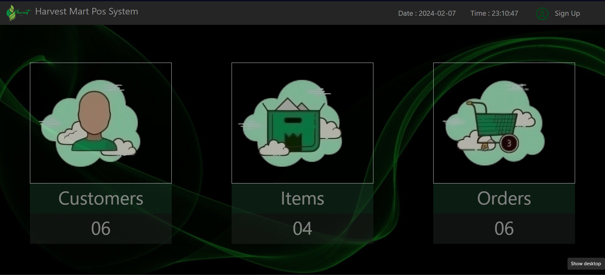
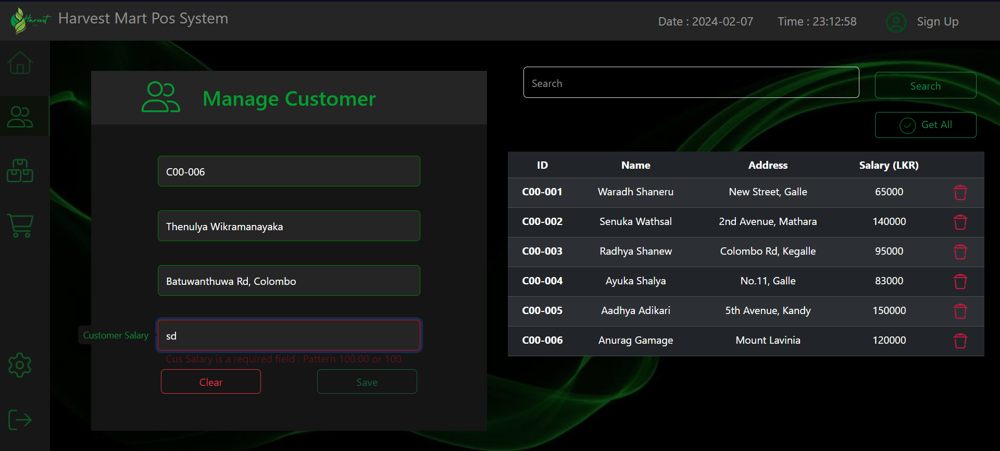
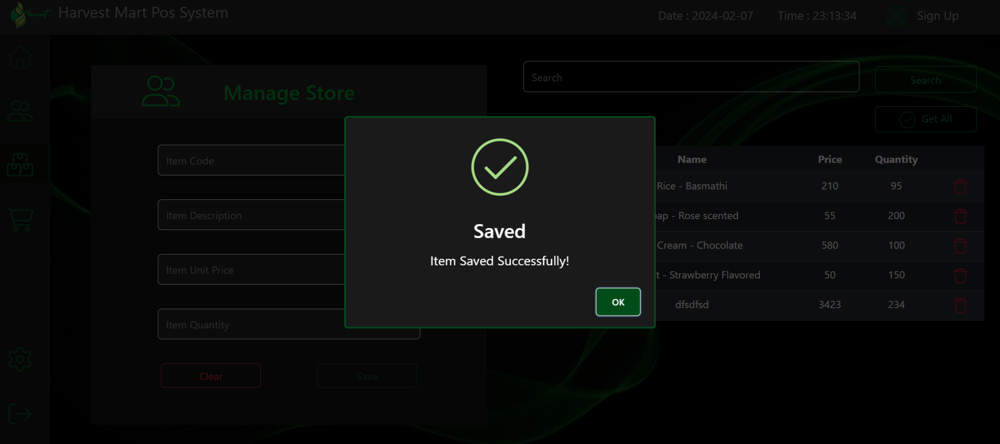
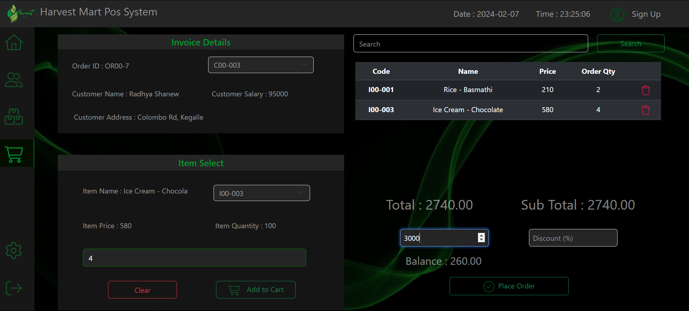

# Harvest Mart Pos System

Harvest Mart Pos System is a robust solution designed to streamline transactions and enhance business operations with user-friendly interfaces and functionalities. 

## Technology stack 
    ✅JavaEE ✅HTML ✅CSS ✅JS ✅MySQL ✅Hibernate ✅Layeered Architecture

## Functions 

- Implementing basic crud operations

- Ensuring fundamental validations

- User-friendly atmosphere for easy access

- Place Order Management

